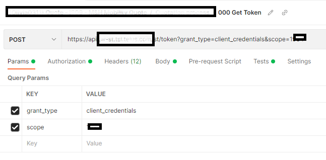
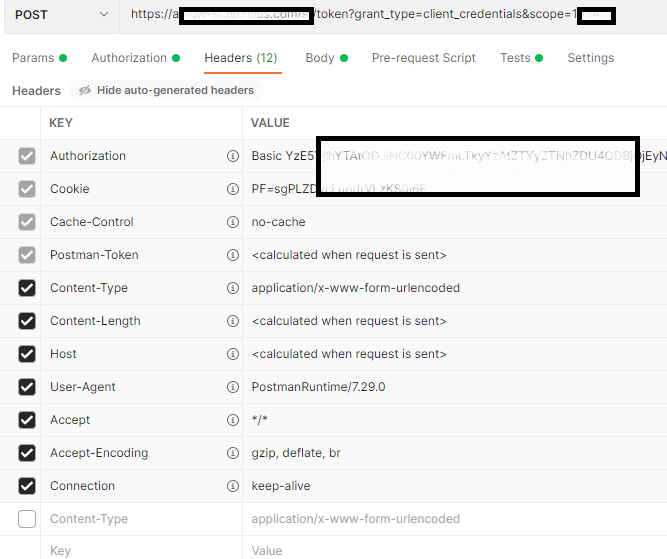

# MyPostman

My Postman

## Simple solutions for calling APIs with the recent token

There are a few ways.

### A "Get Token" request + a env variable




username <-> client ID

password <-> client secret




Postman script:

```
var jsonData = JSON.parse(responseBody);
postman.setGlobalVariable("access_token", jsonData.access_token);
```

Note: based on the version, the syntax may have different variants.


### Get token in the Postman script (in collection level)

### Get token in the Postman script (in request level)
