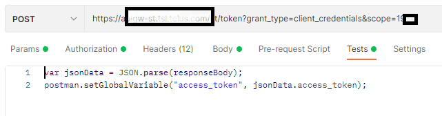

# How to re-use token in Postman

There are a few ways.

## A token post request + an env variable (not recommended)


username <-> client ID

password <-> client secret





## Get token in the Postman script (Recommended)

Postman script:

```dos
var jsonData = JSON.parse(responseBody);
postman.setGlobalVariable("access_token", jsonData.access_token);
```

The toke can be saved in 3 scopes for re-use purpose.

- Global level
- Collection level
- Request level

Note:

The syntax may have different variants for different Postman versions.

```postman
const tokenUrl = 'https://<token_url>';
const grant_type = 'client_credentials';
const scope = '<scope>';
const clientId = "<clientID>";
const clientSecret = "<clientSecret>";

const getTokenRequest = {
  method: 'POST',
  url: tokenUrl,
  header: 'Content-Type:application/x-www-form-urlencoded',
  body: {
      mode: 'urlencoded',
      urlencoded: [
          { key: 'grant_type', value: grant_type },
          { key: 'scope', value: scope },
          { key: 'client_id', value: clientId },
          { key: 'client_secret', value: clientSecret }
      ]
  }
};

pm.sendRequest(getTokenRequest, (err, response) => {
  const jsonResponse = response.json();
  const access_token = jsonResponse.access_token;
  console.log("[Request] jsonResponse: ", jsonResponse);
  console.log("[Request] access_token: ", access_token);
  pm.variables.set('access_token', access_token);
});
```


